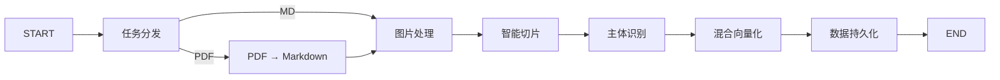

# **企业级智能知识库系统 — 基于 RAG 的文档检索与智能问答平台**

# 🧠 BOSS 智库

<p align="center">
  <strong>企业级智能知识库系统 — 基于 RAG 的文档检索与智能问答平台</strong>
</p>

<p align="center">
  
  
  
  
  
</p>

<p align="center">
  <a href="#-功能特性">功能特性</a> •
  <a href="#-系统架构">系统架构</a> •
  <a href="#-技术栈">技术栈</a> •
  <a href="#-快速开始">快速开始</a> •
  <a href="#-项目结构">项目结构</a> •
  <a href="#-使用示例">使用示例</a>
</p>

---

## 📖 项目简介

BOSS 智库是一个基于 **RAG（检索增强生成）** 技术的企业级智能知识库系统，面向垂直领域（如电子产品手册、维修指南、技术文档等），提供从文档导入、智能解析到精准问答的全链路解决方案。

**核心能力：** 将非结构化的 PDF / Markdown 文档转化为可检索的结构化知识，通过多路召回策略实现高精度检索，并以流式对话方式输出智能回答。

---

## ✨ 功能特性

### 📥 数据导入流水线

| 功能 | 描述 |
|------|------|
| **文档智能解析** | 支持 PDF / Markdown 多格式导入，PDF 通过 MinerU 云端 API 高精度转换为 Markdown |
| **多模态图片理解** | 使用 VLM（视觉语言模型）自动为文档图片生成中文摘要，实现图文语义对齐 |
| **智能文档切片** | 基于句子边界的智能切分，支持重叠策略，保留上下文完整性 |
| **主体识别与标签提取** | 自动识别文档中的商品 / 产品名称，提取关键标签 |
| **混合向量化** | BGE-M3 模型生成稠密向量 + 稀疏向量，双通道存储 |
| **数据持久化** | 向量数据写入 Milvus，原始文件存储至 MinIO |

### 🔍 智能检索系统

| 功能 | 描述 |
|------|------|
| **混合向量检索** | 稠密向量（语义匹配）+ 稀疏向量 BM25（关键词匹配）双路融合 |
| **HyDE 检索** | Hypothetical Document Embeddings — 大模型预生成假设答案，提升召回率 |
| **MCP 联网搜索** | 通过 Model Context Protocol 接入实时网络搜索 |
| **RRF 多路融合** | Reciprocal Rank Fusion 算法融合多路召回结果 |
| **智能重排序** | BGE-Reranker 交叉编码器精排 + 断崖检测动态截断 |
| **流式问答** | SSE（Server-Sent Events）实时推送，逐字输出答案 |
| **会话历史管理** | MongoDB 持久化对话历史，支持上下文连续对话 |

---

## 🏗️ 系统架构

```
┌─────────────────────────────────────────────────────────┐
│                    前端展示层                              │
│            HTML5 + JavaScript + SSE 流式渲染              │
├─────────────────────────────────────────────────────────┤
│                  API 与编排层                              │
│         FastAPI (HTTP)  +  LangGraph (状态图编排)          │
├─────────────────────────────────────────────────────────┤
│                   AI 能力层                               │
│   Qwen 系列大模型 (文本理解/图片总结)  +  BGE 系列 (嵌入/重排) │
├─────────────────────────────────────────────────────────┤
│                   数据存储层                              │
│      Milvus (向量检索)  |  MongoDB (对话历史)  |  MinIO (文件) │
└─────────────────────────────────────────────────────────┘
```

### 数据导入流程



---

## 🛠️ 技术栈

| 类别 | 技术 | 说明 |
|------|------|------|
| **后端框架** | [FastAPI](https://fastapi.tiangolo.com/) + [Uvicorn](https://www.uvicorn.org/) | 异步高性能 HTTP 服务 |
| **工作流引擎** | [LangGraph](https://langchain-ai.github.io/langgraph/) | 有状态图编排框架 |
| **LLM 框架** | [LangChain](https://python.langchain.com/) | 统一 LLM 调用接口 |
| **大语言模型** | [阿里云 DashScope](https://dashscope.aliyun.com/) (Qwen) | qwen-flash / qwen3-vl-flash |
| **向量嵌入** | [BGE-M3](https://huggingface.co/BAAI/bge-m3) + OpenAI API | 1024维稠密 + 稀疏向量 |
| **重排序模型** | [BGE-Reranker-Large](https://huggingface.co/BAAI/bge-reranker-large) | 交叉编码器精排 |
| **向量数据库** | [Milvus](https://milvus.io/) 2.5.5 | 混合检索（稠密+稀疏） |
| **文档数据库** | [MongoDB](https://www.mongodb.com/) | 对话历史持久化 |
| **对象存储** | [MinIO](https://min.io/) | 文件与图片存储 |
| **PDF 解析** | [MinerU](https://github.com/opendatalab/MinerU) | 支持公式、表格等复杂排版 |
| **Python 环境** | [uv](https://github.com/astral-sh/uv) | 极速依赖管理 |

---

## 🚀 快速开始

### 前置条件

- Python 3.11+
- Docker & Docker Compose
- 阿里云 DashScope API Key（[申请地址](https://dashscope.console.aliyun.com/)）
- MinerU API Token（[申请地址](https://mineru.net/apiManage/token)）

### 1. 克隆项目

```bash
git clone https://github.com/your-username/boss-knowledge-base.git
cd boss-knowledge-base
```

### 2. 部署中间件

使用 Docker 一键部署 Milvus、MongoDB、MinIO：

```bash
# 部署 MinIO
docker run -d --name minio --restart always \
    -p 9000:9000 -p 9001:9001 \
    -e "MINIO_ROOT_USER=minioadmin" \
    -e "MINIO_ROOT_PASSWORD=minioadmin" \
    -v "$(pwd)/volumes/minio/data:/data" \
    quay.io/minio/minio:RELEASE.2024-12-18T13-15-44Z server /data \
    --console-address ":9001"

# 部署 Milvus（使用官方 docker-compose）
wget https://github.com/milvus-io/milvus/releases/download/v2.5.5/milvus-standalone-docker-compose.yml -O docker-compose.yml
docker compose up -d

# 部署 MongoDB
docker run -d --name mongo --restart always -p 27017:27017 mongo
```

### 3. 配置环境变量

```bash
# 复制配置模板
cp .env.example .env

# 编辑 .env 文件，填入你的 API Key 和服务地址
```

关键配置项：

```ini
# LLM API
OPENAI_API_KEY=sk-your-dashscope-api-key
OPENAI_API_BASE=https://dashscope.aliyuncs.com/compatible-mode/v1

# MinerU
MINERU_API_TOKEN=your-mineru-token
MINERU_BASE_URL=https://mineru.net/api/v4

# 数据库连接
MILVUS_URL=http://localhost:19530
MONGO_URL=mongodb://localhost:27017
MINIO_ENDPOINT=localhost:9000
```

### 4. 创建 Python 虚拟环境

```bash
# 使用 uv 创建环境并安装依赖
uv python install 3.11
uv sync
```

### 5. 启动服务

```bash
# 启动导入服务（端口 8000）
uvicorn api.import_router:app --port 8000

# 启动查询服务（端口 8001）
uvicorn api.query_router:app --port 8001
```

---

## 📁 项目结构

```
knowledge/
├── api/                              # API 路由层
│   ├── import_router.py              #   导入服务 (POST /upload)
│   └── query_router.py               #   查询服务 (POST /query, GET /stream)
│
├── processor/                        # LangGraph 工作流
│   ├── import_processor/             #   📥 导入流程
│   │   ├── main_graph.py             #     主图定义
│   │   ├── state.py                  #     状态类型 (TypedDict)
│   │   ├── base.py                   #     节点基类 (ABC)
│   │   └── nodes/                    #     处理节点
│   │       ├── node_entry.py         #       任务分发
│   │       ├── node_pdf_to_md.py     #       PDF → Markdown
│   │       ├── node_md_img.py        #       多模态图片理解
│   │       ├── node_document_split.py#       智能文档切片
│   │       ├── node_item_name_recognition.py # 主体识别
│   │       ├── node_bge_embedding.py #       混合向量化
│   │       └── node_import_milvus.py #       数据持久化
│   │
│   └── query_processor/              #   🔍 查询流程
│       ├── main_graph.py             #     主图定义
│       └── nodes/                    #     处理节点
│           ├── vector_search.py      #       向量检索
│           ├── hyde_search.py        #       HyDE 检索
│           ├── web_search_mcp.py     #       MCP 联网搜索
│           ├── rrf.py                #       RRF 融合
│           ├── rerank.py             #       重排序
│           └── answer_output.py      #       答案生成
│
├── config/                           # 配置管理
├── utils/                            # 工具函数库
│   ├── milvus_utils.py               #   Milvus 操作
│   ├── embedding_utils.py            #   向量嵌入
│   ├── llm_utils.py                  #   LLM 封装
│   ├── reranker_utils.py             #   重排序
│   ├── mongo_history_utils.py        #   历史记录
│   ├── sse_utils.py                  #   SSE 流式推送
│   └── minio_utils.py                #   MinIO 操作
│
├── schema/                           # Pydantic 数据模型
├── services/                         # 业务服务层
├── front/                            # 前端页面
│   ├── chat.html                     #   聊天界面
│   └── import.html                   #   导入界面
│
├── .env                              # 环境配置（不提交 Git）
├── .env.example                      # 配置模板
├── pyproject.toml                    # 依赖声明
└── uv.lock                           # 依赖锁定
```

---

## 💡 使用示例

### 导入文档

```bash
curl -X POST http://localhost:8000/upload \
  -F "file=@product_manual.pdf"
```

### 智能问答

```bash
curl -X POST http://localhost:8001/query \
  -H "Content-Type: application/json" \
  -d '{"question": "如何更换电池？", "session_id": "user_001"}'
```

### 流式获取答案

```bash
# SSE 流式推送，逐字输出
curl -N http://localhost:8001/stream/user_001
```

---

## 🔑 核心设计模式

| 模式 | 应用位置 | 说明 |
|------|---------|------|
| **模板方法** | `BaseNode.__call__` + `process` | 父类定骨架，子类填逻辑 |
| **单例模式** | `get_config()` | 全局唯一配置对象，避免重复创建 |
| **策略路由** | `route_after_entry()` | 根据文件类型动态选择处理分支 |
| **滑动窗口限流** | `_apply_api_rate_limit()` | 保护 API 调用频率，防止触发限流 |
| **异步轮询** | MinerU PDF 解析 | 长任务异步处理，固定间隔检查状态 |

---

## 📊 适用场景

- 📘 **产品手册问答** — 电子产品使用说明、维修手册
- 📄 **技术文档检索** — API 文档、开发指南、FAQ
- 🏢 **企业知识库** — 内部制度、操作规范、培训资料
- 🎧 **售后客服支持** — 产品故障排查、使用指导

---

## 📝 开发计划

- [x] 数据导入流水线（PDF / Markdown 解析 → 向量化入库）
- [x] 多模态图片理解与摘要生成
- [x] 混合向量检索 + HyDE + MCP 联网搜索
- [x] RRF 多路融合 + Rerank 重排序
- [x] SSE 流式问答 + 会话历史管理
- [ ] 权限管理与多租户支持
- [ ] 知识图谱增强检索
- [ ] 前端 UI 优化

---

## 📜 License

MIT License

---

<p align="center">
  <sub>Made with ❤️ by BOSS Team</sub>
</p>

---

> 本内容由 Coze AI 生成，请遵循相关法律法规及《人工智能生成合成内容标识办法》使用与传播。
